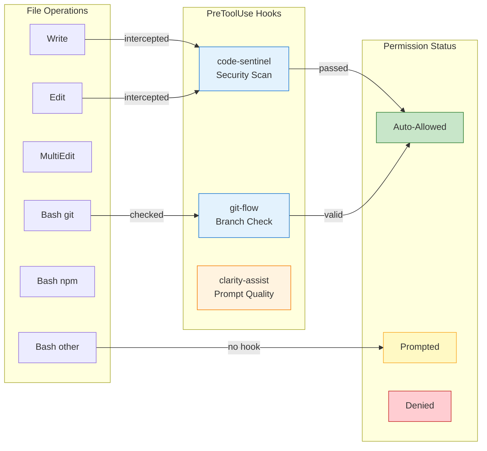

# /claude-config permissions-map

Generate a Mermaid diagram showing the relationship between file operations, review layers, and permission status.

## Skills to Load

Before executing, load:
- `skills/visual-header.md`
- `skills/settings-optimization.md`

Also read: `/mnt/skills/user/mermaid-diagrams/SKILL.md` (for diagram requirements)

## Visual Output

```
+-----------------------------------------------------------------+
|  CONFIG-MAINTAINER - Permissions Map                             |
+-----------------------------------------------------------------+
```

## Usage

```
/claude-config permissions-map           # Generate and display diagram
/claude-config permissions-map --save    # Save diagram to .mermaid file
```

## Workflow

### Step 1: Detect Active Hooks

Read all plugin hooks from the marketplace:

```
plugins/code-sentinel/hooks/hooks.json
plugins/git-flow/hooks/hooks.json
plugins/cmdb-assistant/hooks/hooks.json
plugins/clarity-assist/hooks/hooks.json
```

For each hook, extract:
- Event type (PreToolUse, UserPromptSubmit)
- Tool matchers (Write, Edit, MultiEdit, Bash patterns)
- Hook command/script

### Step 2: Map Hooks to File Scopes

Create a mapping of which review layers cover which operations:

| Operation | PreToolUse Hooks | Other Gates |
|-----------|------------------|-------------|
| Write | code-sentinel | PR review |
| Edit | code-sentinel | PR review |
| MultiEdit | code-sentinel | PR review |
| Bash(git *) | git-flow | — |
| MCP(netbox create/update) | cmdb-assistant | — |

### Step 3: Read Current Permissions

Load `.claude/settings.local.json` and parse:
- `allow` array → auto-allowed operations
- `deny` array → blocked operations
- `ask` array → always-prompted operations

### Step 4: Generate Mermaid Flowchart

**Diagram requirements (from mermaid-diagrams skill):**
- Use `classDef` for styling
- Maximum 3 colors (blue, green, amber/purple)
- Semantic arrow labels
- Left-to-right flow

**Structure:**



### Step 5: Generate Coverage Summary Table

```
Review Layer Coverage Summary
=============================

| Directory Scope          | Layers | Status          | Recommendation |
|--------------------------|--------|-----------------|----------------|
| plugins/*/commands/*.md  |   3    | ✓ Auto-allowed  | — |
| plugins/*/skills/*.md    |   2    | ✓ Auto-allowed  | — |
| mcp-servers/**/*.py      |   3    | ✓ Auto-allowed  | — |
| docs/**                  |   2    | ✓ Auto-allowed  | — |
| scripts/*.sh             |   2    | ⚠ Prompted      | Consider auto-allow |
| .env*                    |   0    | ✗ Denied        | Correct - secrets |
| Root directory           |   1    | ⚠ Prompted      | Keep prompted |

Legend:
  ✓ = Covered by ≥2 review layers, auto-allowed
  ⚠ = Fewer than 2 layers or not allowed
  ✗ = Explicitly denied
```

### Step 6: Identify Gaps

Report any gaps in coverage:

```
Coverage Gaps Detected:
  1. Bash(npm *) — not in allow list, but npm operations are common
     → 2 review layers active, could be auto-allowed

  2. mcp__data-platform__* — MCP server configured but tools not allowed
     → Add to allow list to avoid prompts

  3. scripts/*.sh — 2 review layers but still prompted
     → Consider adding Write(scripts/**) to allow
```

### Step 7: Output Diagram

Display the Mermaid diagram inline.

If `--save` flag is used:
- Save to `.claude/permissions-map.mermaid`
- Report the file path

## Output Format

```
+-----------------------------------------------------------------+
|  CONFIG-MAINTAINER - Permissions Map                             |
+-----------------------------------------------------------------+

Review Layer Status
===================

PreToolUse Hooks (intercept before operation):
  ✓ code-sentinel — Write, Edit, MultiEdit
  ✓ git-flow — Bash(git checkout *), Bash(git commit *)
  ✓ cmdb-assistant — MCP(netbox create/update)

UserPromptSubmit Hooks (check prompt quality):
  ✓ clarity-assist — vagueness detection

Other Review Gates:
  ✓ Sprint Approval (projman milestone workflow)
  ✓ PR Review (pr-review multi-agent)

Permissions Flow Diagram
========================

```mermaid
[diagram here]
```

Coverage Summary
================

[table here]

Gaps & Recommendations
======================

[gaps list here]
```

## File Output (--save flag)

When `--save` is specified:

```
Diagram saved to: .claude/permissions-map.mermaid

To view:
  - Open in VS Code with Mermaid extension
  - Paste into https://mermaid.live
  - Include in documentation with ```mermaid code fence
```

## Color Scheme

| Element | Color | Hex |
|---------|-------|-----|
| PreToolUse hooks | Blue | #e3f2fd |
| Sprint/Planning gates | Amber | #fff3e0 |
| PR Review | Purple | #f3e5f5 |
| Auto-allowed | Light green | #c8e6c9 |
| Prompted | Light yellow | #fff9c4 |
| Denied | Light red | #ffcdd2 |

## DO NOT

- Generate diagrams without reading the mermaid-diagrams skill
- Use more than 3 primary colors in the diagram
- Skip the coverage summary table
- Fail to identify coverage gaps
