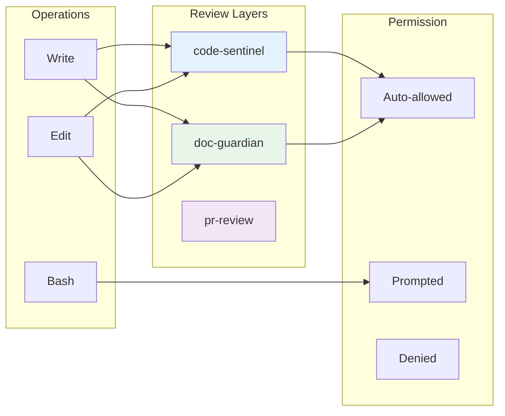

# /config-audit-settings

Audit Claude Code `settings.local.json` permissions with 100-point scoring across redundancy, coverage, safety alignment, and profile fit.

## Skills to Load

Before executing, load:
- `skills/visual-header.md`
- `skills/settings-optimization.md`

## Visual Output

```
+-----------------------------------------------------------------+
|  CONFIG-MAINTAINER - Settings Audit                              |
+-----------------------------------------------------------------+
```

## Usage

```
/config-audit-settings              # Full audit with recommendations
/config-audit-settings --diagram    # Include Mermaid diagram of review layer coverage
```

## Workflow

### Step 1: Locate Settings Files

Search in order:
1. `.claude/settings.local.json` (primary target)
2. `.claude/settings.json` (shared config)
3. `~/.claude.json` project entry (legacy)

Report which format is in use.

### Step 2: Parse Permission Arrays

Extract and analyze:
- `permissions.allow` array
- `permissions.deny` array
- `permissions.ask` array (if present)
- Legacy `allowedTools` array (if legacy format)

### Step 3: Run Pattern Consolidation Analysis

Using `settings-optimization.md` Section 3, detect:

| Check | Description |
|-------|-------------|
| Duplicates | Exact same pattern appearing multiple times |
| Subsets | Narrower patterns covered by broader ones |
| Merge candidates | 4+ similar patterns that could be consolidated |
| Overly broad | Unscoped tool permissions (e.g., `Bash` without pattern) |
| Stale entries | Patterns referencing non-existent paths |
| Conflicts | Same pattern in both allow and deny |

### Step 4: Detect Active Marketplace Hooks

Read `plugins/*/hooks/hooks.json` files:

```bash
# Check each plugin's hooks
plugins/code-sentinel/hooks/hooks.json     # PreToolUse security
plugins/doc-guardian/hooks/hooks.json      # PostToolUse drift detection
plugins/project-hygiene/hooks/hooks.json   # PostToolUse cleanup
plugins/data-platform/hooks/hooks.json     # PostToolUse schema diff
plugins/contract-validator/hooks/hooks.json # Plugin validation
```

Parse each to identify:
- Hook event type (PreToolUse, PostToolUse)
- Tool matchers (Write, Edit, MultiEdit, Bash)
- Whether hook is command type (reliable) or prompt type (unreliable)

### Step 5: Map Review Layers to Directory Scopes

For each directory scope in `settings-optimization.md` Section 4:
1. Count how many review layers are verified active
2. Determine if auto-allow is justified (≥2 layers required)
3. Note any scopes that lack coverage

### Step 6: Compare Against Recommended Profile

Based on review layer count:
- 0-1 layers: Recommend `conservative` profile
- 2+ layers: Recommend `reviewed` profile
- CI/sandboxed: May recommend `autonomous` profile

Calculate profile fit percentage.

### Step 7: Generate Scored Report

Calculate scores using `settings-optimization.md` Section 6.

## Output Format

```
Settings Efficiency Score: XX/100
  Redundancy:       XX/25
  Coverage:         XX/25
  Safety Alignment: XX/25
  Profile Fit:      XX/25

Current Profile: [closest match or "custom"]
Recommended Profile: [target based on review layers]

Issues Found:
  🔴 CRITICAL: [description]
  🟠 HIGH: [description]
  🟡 MEDIUM: [description]
  🔵 LOW: [description]

Active Review Layers Detected:
  ✓ code-sentinel (PreToolUse: Write|Edit|MultiEdit)
  ✓ doc-guardian (PostToolUse: Write|Edit|MultiEdit)
  ✓ project-hygiene (PostToolUse: Write|Edit)
  ✗ data-platform schema-diff (not detected)

Recommendations:
  1. [specific action with pattern]
  2. [specific action with pattern]
  ...

Follow-Up Actions:
  1. Run /config-optimize-settings to apply recommendations
  2. Run /config-optimize-settings --dry-run to preview first
  3. Run /config-optimize-settings --profile=reviewed to apply profile
```

## Diagram Output (--diagram flag)

When `--diagram` is specified, generate a Mermaid flowchart showing:

**Before generating:** Read `/mnt/skills/user/mermaid-diagrams/SKILL.md` for diagram requirements.

**Diagram structure:**
- Left column: File operation types (Write, Edit, Bash)
- Middle: Review layers that intercept each operation
- Right column: Current permission status (auto-allowed, prompted, denied)

**Color coding:**
- PreToolUse hooks: Blue
- PostToolUse hooks: Green
- Sprint Approval: Amber
- PR Review: Purple

Example structure:


## Issue Severity Levels

| Severity | Icon | Examples |
|----------|------|----------|
| CRITICAL | 🔴 | Unscoped `Bash` in allow, missing deny for secrets |
| HIGH | 🟠 | Overly broad patterns, missing MCP coverage |
| MEDIUM | 🟡 | Subset redundancy, merge candidates |
| LOW | 🔵 | Exact duplicates, minor optimizations |

## DO NOT

- Modify any files (this is audit only)
- Recommend `autonomous` profile unless explicitly sandboxed environment
- Recommend auto-allow for scopes with <2 verified review layers
- Skip hook verification before making recommendations
