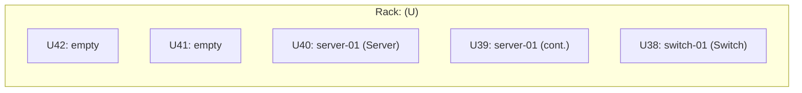
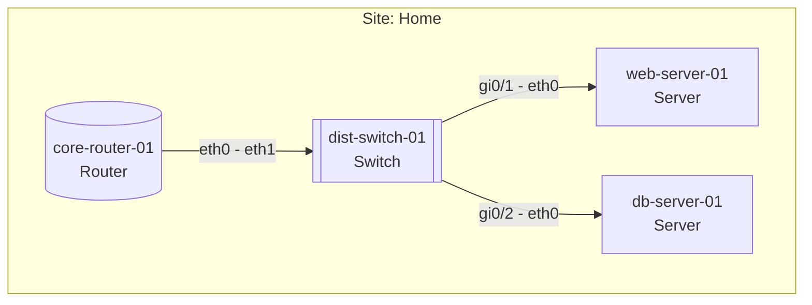
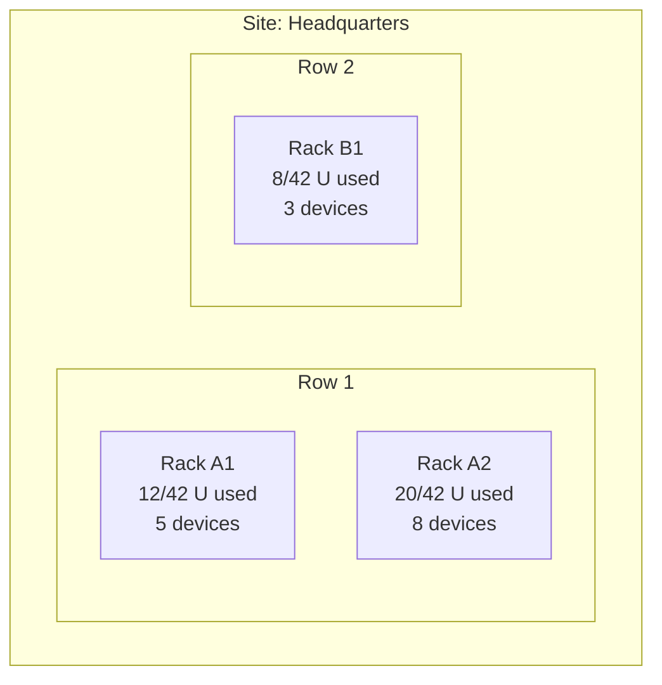
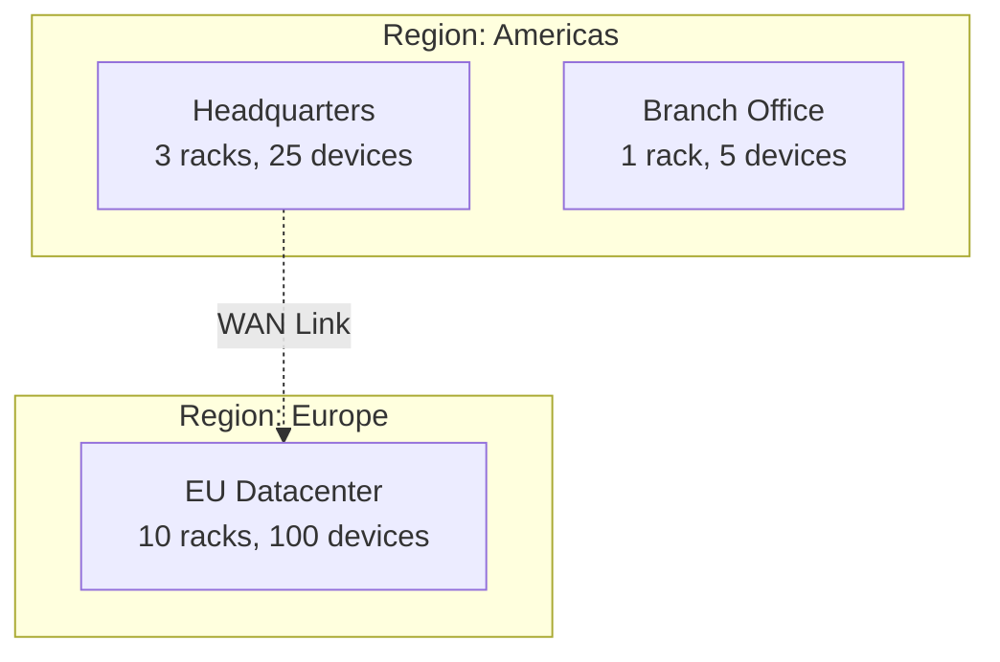
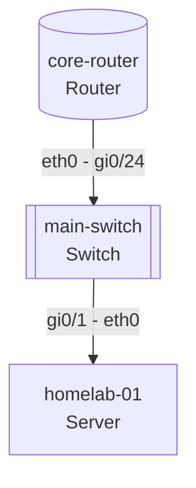

# CMDB Topology Visualization

## Visual Output

When executing this command, display the plugin header:

```
┌──────────────────────────────────────────────────────────────────┐
│  🖥️ CMDB-ASSISTANT · Topology                                    │
└──────────────────────────────────────────────────────────────────┘
```

Then proceed with the visualization.

Generate Mermaid diagrams showing infrastructure topology from NetBox.

## Usage

```
/cmdb-topology <view> [scope]
```

**Views:**
- `rack <rack-name>` - Rack elevation showing devices and positions
- `network [site]` - Network topology showing device connections via cables
- `site <site-name>` - Site overview with racks and device counts
- `full` - Full infrastructure overview

## Instructions

You are a topology visualization assistant that queries NetBox and generates Mermaid diagrams.

### View: Rack Elevation

Generate a rack view showing devices and their positions.

**Data Collection:**
1. Use `dcim_list_racks` to find the rack by name
2. Use `dcim_list_devices` with `rack_id` filter to get devices in rack
3. For each device, note: `position`, `u_height`, `face`, `name`, `role`

**Mermaid Output:**



**For devices spanning multiple U:**
- Mark the top U with device name and role
- Mark subsequent Us as "(cont.)" for the same device
- Empty Us should show "empty"

### View: Network Topology

Generate a network diagram showing device connections.

**Data Collection:**
1. Use `dcim_list_sites` if no site specified (get all)
2. Use `dcim_list_devices` with optional `site_id` filter
3. Use `dcim_list_cables` to get all connections
4. Use `dcim_list_interfaces` for each device to understand port names

**Mermaid Output:**



**Node shapes by role:**
- Router: `[(" ")]` (cylinder/database shape)
- Switch: `[[ ]]` (double brackets)
- Server: `[ ]` (rectangle)
- Firewall: `{{ }}` (hexagon)
- Other: `[ ]` (rectangle)

**Edge labels:** Show interface names on both ends (A-side - B-side)

### View: Site Overview

Generate a site-level view showing racks and summary counts.

**Data Collection:**
1. Use `dcim_get_site` to get site details
2. Use `dcim_list_racks` with `site_id` filter
3. Use `dcim_list_devices` with `site_id` filter for counts per rack

**Mermaid Output:**



### View: Full Infrastructure

Generate a high-level view of all sites and their relationships.

**Data Collection:**
1. Use `dcim_list_regions` to get hierarchy
2. Use `dcim_list_sites` to get all sites
3. Use `dcim_list_devices` with status filter for counts

**Mermaid Output:**



### Output Format

Always provide:

1. **Summary** - Brief description of what the diagram shows
2. **Mermaid Code Block** - The diagram code in a fenced code block
3. **Legend** - Explanation of shapes and colors used
4. **Data Notes** - Any data quality issues (e.g., devices without position, missing cables)

**Example Output:**

```markdown
## Network Topology: Home Site

This diagram shows the network connections between 4 devices at the Home site.



**Legend:**
- Cylinder shape: Routers
- Double brackets: Switches
- Rectangle: Servers

**Data Notes:**
- 1 device (nas-01) has no cable connections documented
```

## Examples

- `/cmdb-topology rack server-rack-01` - Show devices in server-rack-01
- `/cmdb-topology network` - Show all network connections
- `/cmdb-topology network Home` - Show network topology for Home site only
- `/cmdb-topology site Headquarters` - Show rack overview for Headquarters
- `/cmdb-topology full` - Show full infrastructure overview

## User Request

$ARGUMENTS
