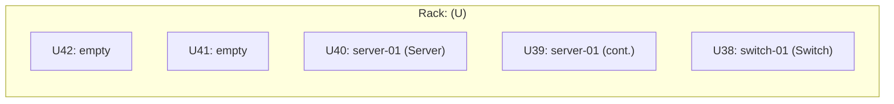
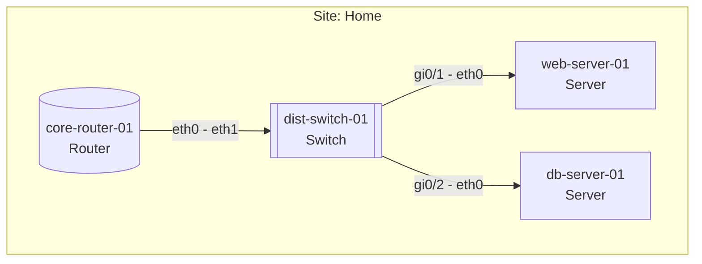
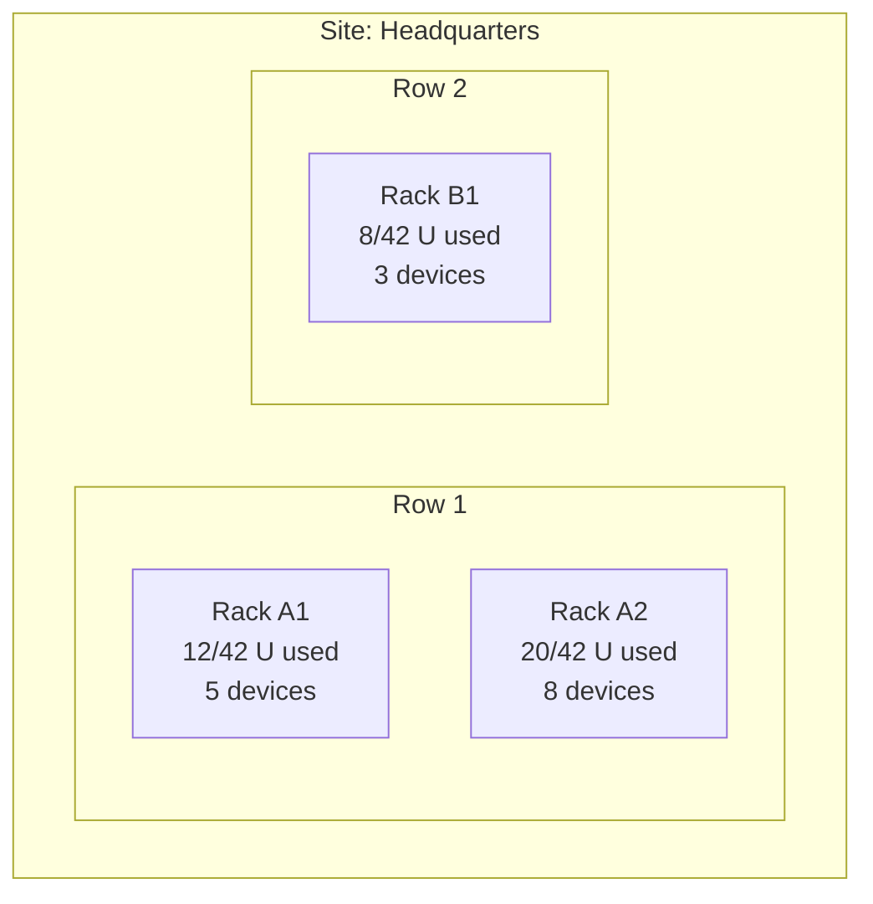
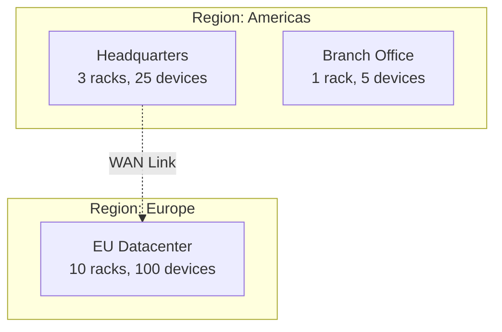
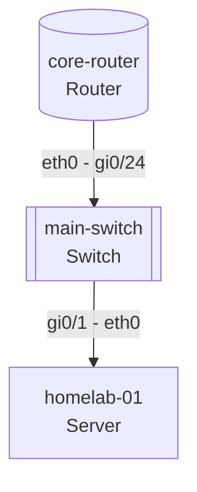

# Topology Generation Skill

Generate Mermaid diagrams from NetBox data.

## Prerequisites

Load skill: `mcp-tools-reference`

## View: Rack Elevation

### Data Collection

1. Find rack: `dcim_list_racks name=<name>`
2. Get devices: `dcim_list_devices rack_id=<id>`
3. Note for each: `position`, `u_height`, `face`, `name`, `role`

### Mermaid Template



### Rules

- Mark top U with device name and role
- Mark subsequent Us as "(cont.)" for multi-U devices
- Empty Us show "empty"

## View: Network Topology

### Data Collection

1. List sites: `dcim_list_sites`
2. List devices: `dcim_list_devices site_id=<id>`
3. List cables: `dcim_list_cables`
4. List interfaces: `dcim_list_interfaces device_id=<id>`

### Mermaid Template



### Node Shapes by Role

| Role | Shape | Mermaid Syntax |
|------|-------|----------------|
| Router | Cylinder | `[(" ")]` |
| Switch | Double brackets | `[[ ]]` |
| Server | Rectangle | `[ ]` |
| Firewall | Hexagon | `{{ }}` |
| Other | Rectangle | `[ ]` |

### Edge Labels

Show interface names: `A-side - B-side`

## View: Site Overview

### Data Collection

1. Get site: `dcim_get_site id=<id>`
2. List racks: `dcim_list_racks site_id=<id>`
3. Count devices per rack: `dcim_list_devices rack_id=<id>`

### Mermaid Template



## View: Full Infrastructure

### Data Collection

1. List regions: `dcim_list_regions`
2. List sites: `dcim_list_sites`
3. Count devices: `dcim_list_devices status=active`

### Mermaid Template



## Output Format

Always provide:

1. **Summary** - Brief description of diagram content
2. **Mermaid Code Block** - The diagram code
3. **Legend** - Explanation of shapes and colors
4. **Data Notes** - Any data quality issues

### Example Output

```markdown
## Network Topology: Home Site

This diagram shows network connections between 4 devices at Home site.



**Legend:**
- Cylinder shape: Routers
- Double brackets: Switches
- Rectangle: Servers

**Data Notes:**
- 1 device (nas-01) has no cable connections documented
```
