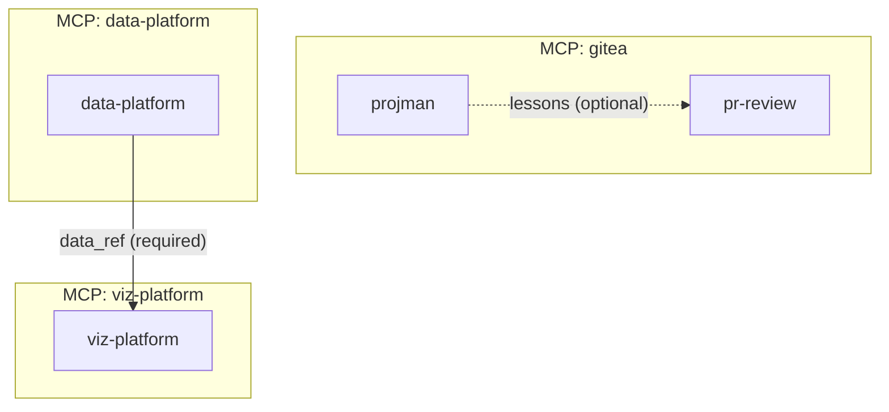
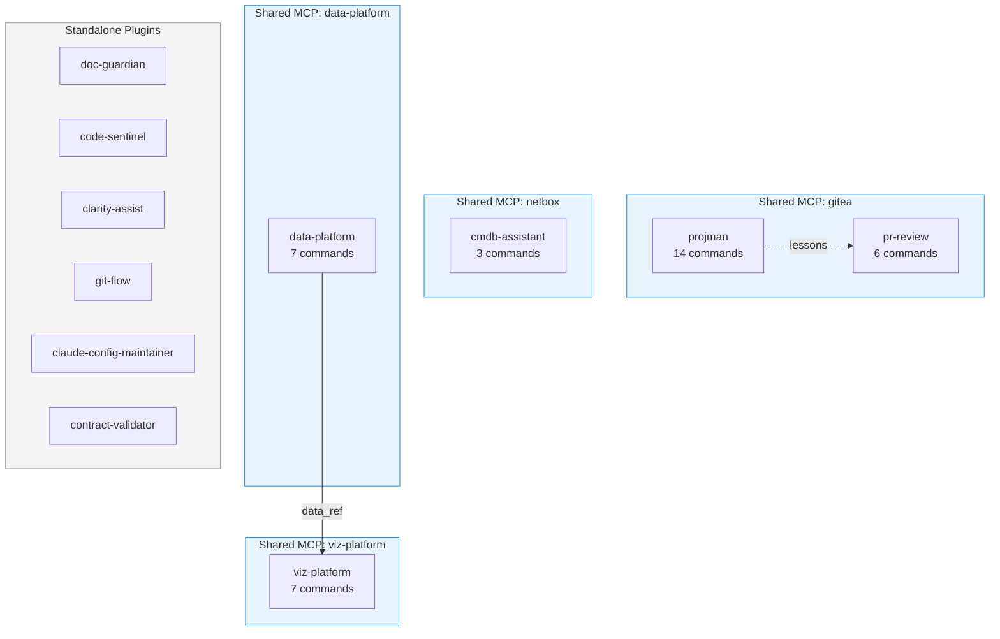

# /dependency-graph - Generate Dependency Visualization

Generate a Mermaid flowchart showing plugin dependencies, data flows, and tool relationships.

## Usage

```
/dependency-graph [marketplace_path] [--format <mermaid|text>] [--show-tools]
```

## Parameters

- `marketplace_path` (optional): Path to marketplace root. Defaults to current project root.
- `--format` (optional): Output format - `mermaid` (default) or `text`
- `--show-tools` (optional): Include individual tool nodes in the graph

## Workflow

1. **Discover plugins**:
   - Scan plugins directory for all plugins with `.claude-plugin/` marker
   - Parse each plugin's README.md to extract interface
   - Parse CLAUDE.md for agent definitions and tool sequences

2. **Analyze dependencies**:
   - Identify shared MCP servers (plugins using same server)
   - Detect tool dependencies (which plugins produce vs consume data)
   - Find agent tool references across plugins
   - Categorize as required (ERROR if missing) or optional (WARNING if missing)

3. **Build dependency graph**:
   - Create nodes for each plugin
   - Create edges for:
     - Shared MCP servers (bidirectional)
     - Data producers -> consumers (directional)
     - Agent tool dependencies (directional)
   - Mark edges as optional or required

4. **Generate Mermaid output**:
   - Create flowchart diagram syntax
   - Style required dependencies with solid lines
   - Style optional dependencies with dashed lines
   - Group by MCP server or data flow

## Output Format

### Mermaid (default)



### Text Format

```
DEPENDENCY GRAPH
================

Plugins: 12
MCP Servers: 4
Dependencies: 8 (5 required, 3 optional)

MCP Server Groups:
  gitea: projman, pr-review
  data-platform: data-platform
  viz-platform: viz-platform
  netbox: cmdb-assistant

Data Flow Dependencies:
  data-platform -> viz-platform (data_ref) [REQUIRED]
  data-platform -> data-platform (data_ref) [INTERNAL]

Cross-Plugin Tool Usage:
  projman.Planner uses: create_issue, search_lessons
  pr-review.reviewer uses: get_pr_diff, create_pr_review
```

## Dependency Types

| Type | Line Style | Meaning |
|------|------------|---------|
| Required | Solid (`-->`) | Plugin cannot function without this dependency |
| Optional | Dashed (`-.->`) | Plugin works but with reduced functionality |
| Internal | Dotted (`...>`) | Self-dependency within same plugin |
| Shared MCP | Double (`==>`) | Plugins share same MCP server instance |

## Known Data Flow Patterns

The command recognizes these producer/consumer relationships:

### Data Producers
- `read_csv`, `read_parquet`, `read_json` - File loaders
- `pg_query`, `pg_execute` - Database queries
- `filter`, `select`, `groupby`, `join` - Transformations

### Data Consumers
- `describe`, `head`, `tail` - Data inspection
- `to_csv`, `to_parquet` - File writers
- `chart_create` - Visualization

### Cross-Plugin Flows
- `data-platform` produces `data_ref` -> `viz-platform` consumes for charts
- `projman` produces issues -> `pr-review` references in reviews
- `gitea` wiki -> `projman` lessons learned

## Examples

### Basic Usage

```
/dependency-graph
```

Generates Mermaid diagram for current marketplace.

### With Tool Details

```
/dependency-graph --show-tools
```

Includes individual tool nodes showing which tools each plugin provides.

### Text Summary

```
/dependency-graph --format text
```

Outputs text-based summary suitable for CLAUDE.md inclusion.

### Specific Path

```
/dependency-graph ~/claude-plugins-work
```

Analyze marketplace at specified path.

## Integration with Other Commands

Use with `/validate-contracts` to:
1. Run `/dependency-graph` to visualize relationships
2. Run `/validate-contracts` to find issues in those relationships
3. Fix issues and regenerate graph to verify

## Available Tools

Use these MCP tools:
- `parse_plugin_interface` - Extract interface from plugin README.md
- `parse_claude_md_agents` - Extract agents and their tool sequences
- `generate_compatibility_report` - Get full interface data (JSON format for analysis)
- `validate_data_flow` - Verify data producer/consumer relationships

## Implementation Notes

### Detecting Shared MCP Servers

Check each plugin's `.mcp.json` file for server definitions:

```bash
# List all .mcp.json files in plugins
find plugins/ -name ".mcp.json" -exec cat {} \;
```

Plugins with identical MCP server names share that server.

### Identifying Data Flows

1. Parse tool categories from README.md
2. Map known producer tools to their output types
3. Map known consumer tools to their input requirements
4. Create edges where outputs match inputs

### Optional vs Required

- **Required**: Consumer tool has no default/fallback behavior
- **Optional**: Consumer works without producer (e.g., lessons search returns empty)

Determination is based on:
- Issue severity from `validate_data_flow` (ERROR = required, WARNING = optional)
- Tool documentation stating "requires" vs "uses if available"

## Sample Output

For the leo-claude-mktplace:


