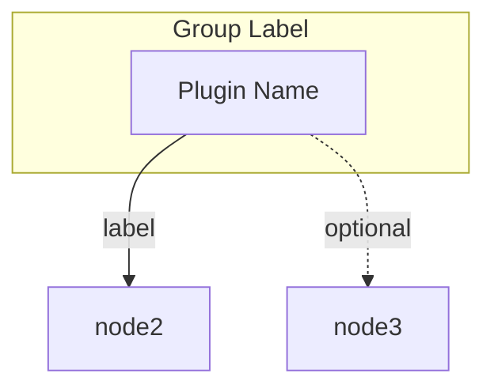

# Skill: Visual Output

Standard visual formatting for contract-validator commands.

## Command Header

Display at the start of every command:

```
+----------------------------------------------------------------------+
|  CONTRACT-VALIDATOR - [Command Name]                                 |
+----------------------------------------------------------------------+
```

## Result Boxes

### Success Box
```
+====================================================================+
|          CONTRACT-VALIDATOR [ACTION] COMPLETE                       |
+====================================================================+
| Item 1:          [checkmark] Status                                 |
| Item 2:          [checkmark] Status                                 |
+====================================================================+
```

### Error Box
```
+====================================================================+
|          CONTRACT-VALIDATOR [ACTION] FAILED                         |
+====================================================================+
| Error:           [description]                                      |
| Suggestion:      [fix]                                              |
+====================================================================+
```

## Summary Tables

### Plugin Summary
```
| Plugin      | Commands | Agents | Tools |
|-------------|----------|--------|-------|
| projman     | 12       | 4      | 26    |
| data-platform| 7       | 2      | 32    |
```

### Issue Summary
```
| Severity | Count |
|----------|-------|
| ERROR    | 2     |
| WARNING  | 5     |
| INFO     | 8     |
```

## Mermaid Diagrams

For dependency graphs, use flowchart TD format:



## Text Format Alternative

For non-graphical output:

```
DEPENDENCY GRAPH
================

Plugins: 12
MCP Servers: 4
Dependencies: 8 (5 required, 3 optional)

MCP Server Groups:
  gitea: projman, pr-review
  data-platform: data-platform
```
