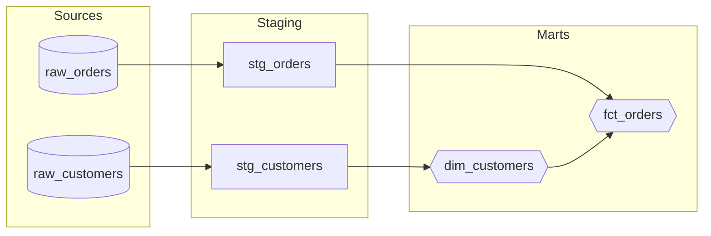
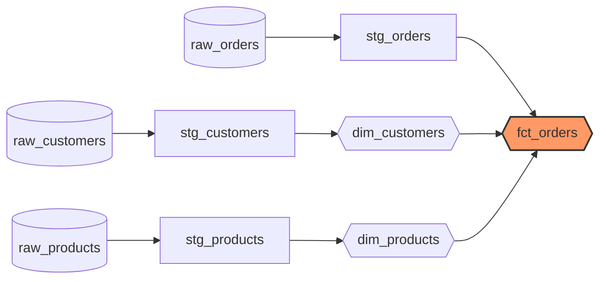

# /lineage-viz - Mermaid Lineage Visualization

Generate Mermaid flowchart syntax for dbt model lineage.

## Usage

```
/lineage-viz <model_name> [--direction TB|LR] [--depth N]
```

## Workflow

1. **Get lineage data**:
   - Use `dbt_lineage` to fetch model dependencies
   - Capture upstream sources and downstream consumers

2. **Build Mermaid graph**:
   - Create nodes for each model/source
   - Style nodes by materialization type
   - Add directional arrows for dependencies

3. **Output**:
   - Render Mermaid flowchart syntax
   - Include copy-paste ready code block

## Output Format



## Node Styles

| Materialization | Mermaid Shape | Example |
|-----------------|---------------|---------|
| source | Cylinder `[( )]` | `raw_data[(raw_data)]` |
| view | Rectangle `[ ]` | `stg_model[stg_model]` |
| table | Double braces `{{ }}` | `dim_model{{dim_model}}` |
| incremental | Hexagon `{{ }}` | `fct_model{{fct_model}}` |
| ephemeral | Dashed `[/ /]` | `tmp_model[/tmp_model/]` |

## Options

| Flag | Description |
|------|-------------|
| `--direction TB` | Top-to-bottom layout (default: LR = left-to-right) |
| `--depth N` | Limit lineage depth (default: unlimited) |

## Examples

```
/lineage-viz dim_customers
/lineage-viz fct_orders --direction TB
/lineage-viz rpt_revenue --depth 2
```

## Usage Tips

1. **Paste in documentation**: Copy the output directly into README.md or docs
2. **GitHub/GitLab rendering**: Both platforms render Mermaid natively
3. **Mermaid Live Editor**: Paste at https://mermaid.live for interactive editing

## Example Output

For `/lineage-viz fct_orders`:

~~~markdown

~~~

## Available Tools

Use these MCP tools:
- `dbt_lineage` - Get model dependencies (REQUIRED)
- `dbt_ls` - List dbt resources
- `dbt_docs_generate` - Generate full manifest if needed
