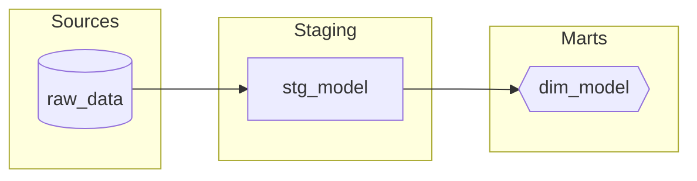

# Lineage Analysis

## Lineage Workflow

1. **Get lineage data** via `dbt_lineage`
2. **Build dependency graph** (upstream + downstream)
3. **Visualize** (ASCII tree or Mermaid)
4. **Report** critical path and refresh implications

## ASCII Tree Format

```
Sources:
  |-- raw_customers (source)
  |-- raw_orders (source)

model_name (materialization)
  |-- upstream:
  |   |-- stg_model (view)
  |       |-- raw_source (source)
  |-- downstream:
      |-- fct_model (incremental)
      |-- rpt_model (table)
```

## Mermaid Diagram Format



## Mermaid Node Shapes

| Materialization | Shape | Syntax |
|-----------------|-------|--------|
| source | Cylinder | `[(name)]` |
| view | Rectangle | `[name]` |
| table | Double braces | `{{name}}` |
| incremental | Hexagon | `{{name}}` |
| ephemeral | Dashed | `[/name/]` |

## Mermaid Options

| Flag | Description |
|------|-------------|
| `--direction TB` | Top-to-bottom (default: LR) |
| `--depth N` | Limit lineage depth |

## Styling Target Model

```mermaid
style target_model fill:#f96,stroke:#333,stroke-width:2px
```

## Usage Tips

1. **Documentation**: Copy Mermaid to README.md
2. **GitHub/GitLab**: Both render Mermaid natively
3. **Live Editor**: https://mermaid.live for interactive editing
