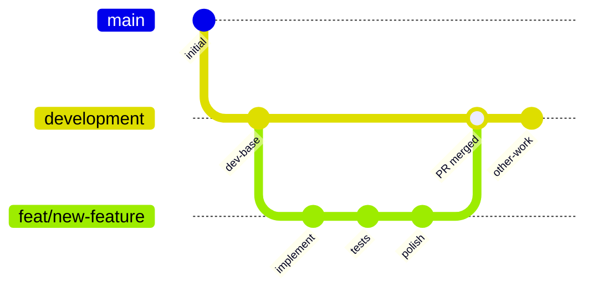
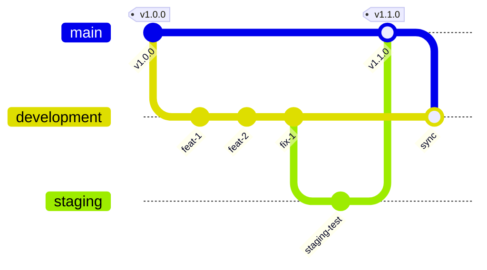
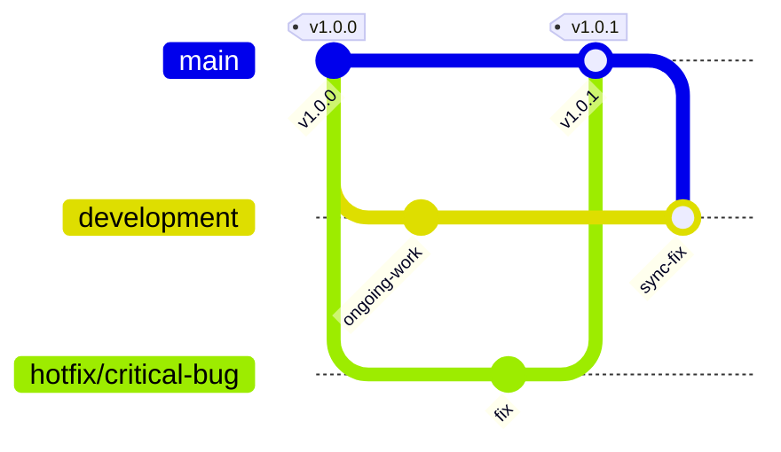
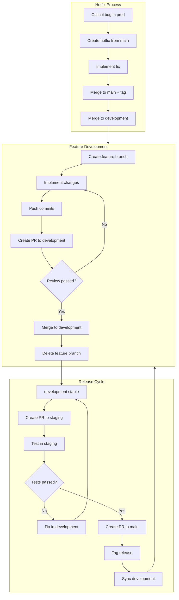
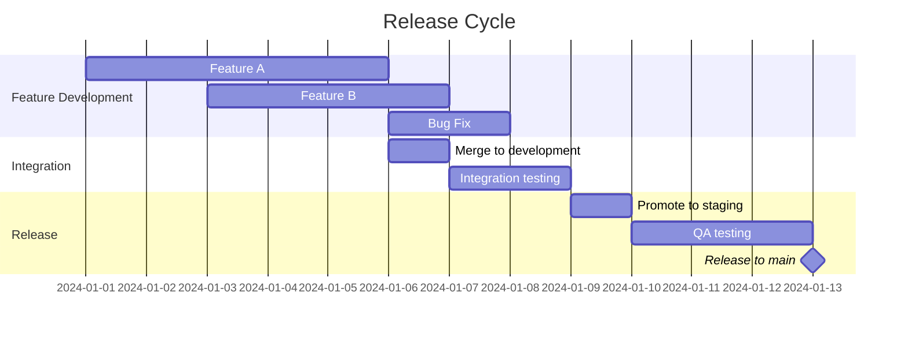

# Branching Strategy

## Overview

This document defines the branching strategy used by git-flow to manage code changes across environments. The strategy ensures:

- **Stability**: Production code is always release-ready
- **Isolation**: Features are developed in isolation without affecting others
- **Traceability**: Clear history of what changed and when
- **Collaboration**: Multiple developers can work simultaneously without conflicts

The strategy follows a hierarchical promotion model: feature branches merge into development, which promotes to staging for testing, and finally to main for production release.

## Branch Types

### Main Branches

| Branch | Purpose | Stability | Direct Commits |
|--------|---------|-----------|----------------|
| `main` | Production releases | Highest | Never |
| `staging` | Pre-production testing | High | Never |
| `development` | Active development | Medium | Never |

### Feature Branches

Feature branches are short-lived branches created from `development` for implementing specific changes.

| Prefix | Purpose | Example |
|--------|---------|---------|
| `feat/` | New features | `feat/user-authentication` |
| `fix/` | Bug fixes | `fix/login-timeout-error` |
| `docs/` | Documentation only | `docs/api-reference` |
| `refactor/` | Code restructuring | `refactor/auth-module` |
| `test/` | Test additions/fixes | `test/auth-coverage` |
| `chore/` | Maintenance tasks | `chore/update-dependencies` |

### Special Branches

| Branch | Purpose | Created From | Merges Into |
|--------|---------|--------------|-------------|
| `hotfix/*` | Emergency production fixes | `main` | `main` AND `development` |
| `release/*` | Release preparation | `development` | `staging` then `main` |

## Branch Hierarchy

```
                    PRODUCTION
                        │
                        ▼
    ┌───────────────[ main ]───────────────┐
    │           (stable releases)           │
    │                   ▲                   │
    │                   │ PR                │
    │                   │                   │
    │           ┌───────┴───────┐           │
    │           │   staging     │           │
    │           │  (testing)    │           │
    │           └───────▲───────┘           │
    │                   │ PR                │
    │                   │                   │
    │         ┌─────────┴─────────┐         │
    │         │   development    │          │
    │         │ (integration)    │          │
    │         └─────────▲─────────┘         │
    │              ╱    │    ╲              │
    │           PR╱     │PR   ╲PR           │
    │           ╱       │      ╲            │
    │    ┌─────┴──┐  ┌──┴───┐  ┌┴─────┐    │
    │    │ feat/* │  │ fix/*│  │docs/*│    │
    │    └────────┘  └──────┘  └──────┘    │
    │         FEATURE BRANCHES              │
    └───────────────────────────────────────┘
```

## Workflow

### Feature Development

The standard workflow for implementing a new feature or fix:



**Steps:**

1. **Create branch from development**
   ```bash
   git checkout development
   git pull origin development
   git checkout -b feat/add-user-auth
   ```
   Or use git-flow command:
   ```
   /branch-start add user authentication
   ```

2. **Implement changes**
   - Make commits following conventional commit format
   - Keep commits atomic and focused
   - Push regularly to remote

3. **Create Pull Request**
   - Target: `development`
   - Include description of changes
   - Link related issues

4. **Review and merge**
   - Address review feedback
   - Squash or rebase as needed
   - Merge when approved

5. **Cleanup**
   - Delete feature branch after merge
   ```
   /branch-cleanup
   ```

### Release Promotion

Promoting code from development to production:



**Steps:**

1. **Prepare release**
   - Ensure development is stable
   - Update version numbers
   - Update CHANGELOG.md

2. **Promote to staging**
   ```bash
   git checkout staging
   git merge development
   git push origin staging
   ```

3. **Test in staging**
   - Run integration tests
   - Perform QA validation
   - Fix any issues (merge fixes to development first, then re-promote)

4. **Promote to main**
   ```bash
   git checkout main
   git merge staging
   git tag -a v1.1.0 -m "Release v1.1.0"
   git push origin main --tags
   ```

5. **Sync development**
   ```bash
   git checkout development
   git merge main
   git push origin development
   ```

### Hotfix Handling

Emergency fixes for production issues:



**Steps:**

1. **Create hotfix branch from main**
   ```bash
   git checkout main
   git pull origin main
   git checkout -b hotfix/critical-security-fix
   ```

2. **Implement fix**
   - Minimal, focused changes only
   - Include tests for the fix
   - Follow conventional commit format

3. **Merge to main**
   ```bash
   git checkout main
   git merge hotfix/critical-security-fix
   git tag -a v1.0.1 -m "Hotfix: critical security fix"
   git push origin main --tags
   ```

4. **Merge to development** (critical step)
   ```bash
   git checkout development
   git merge main
   git push origin development
   ```

5. **Delete hotfix branch**
   ```bash
   git branch -d hotfix/critical-security-fix
   git push origin --delete hotfix/critical-security-fix
   ```

## PR Requirements

### To development

| Requirement | Description |
|-------------|-------------|
| Passing tests | All CI tests must pass |
| Conventional commit | Message follows `type(scope): description` format |
| No conflicts | Branch must be rebased on latest development |
| Code review | At least one approval (recommended) |

### To staging

| Requirement | Description |
|-------------|-------------|
| All checks pass | CI, linting, tests, security scans |
| From development | Only PRs from development branch |
| Clean history | Squashed or rebased commits |
| Release notes | CHANGELOG updated with version |

### To main (Protected)

| Requirement | Description |
|-------------|-------------|
| Source restriction | PRs only from `staging` or `development` |
| All checks pass | Complete CI pipeline success |
| Approvals | Minimum 1-2 reviewer approvals |
| No direct push | Force push disabled |
| Version tag | Must include version tag on merge |

## Branch Flow Diagram

### Complete Lifecycle



### Release Cycle Timeline



## Examples

### Example 1: Adding a New Feature

**Scenario:** Add user password reset functionality

```bash
# 1. Start from development
git checkout development
git pull origin development

# 2. Create feature branch
git checkout -b feat/password-reset

# 3. Make changes and commit
git add src/auth/password-reset.ts
git commit -m "feat(auth): add password reset request handler"

git add src/email/templates/reset-email.html
git commit -m "feat(email): add password reset email template"

git add tests/auth/password-reset.test.ts
git commit -m "test(auth): add password reset tests"

# 4. Push and create PR
git push -u origin feat/password-reset
# Create PR targeting development

# 5. After merge, cleanup
git checkout development
git pull origin development
git branch -d feat/password-reset
```

### Example 2: Bug Fix

**Scenario:** Fix login timeout issue

```bash
# 1. Create fix branch
git checkout development
git pull origin development
git checkout -b fix/login-timeout

# 2. Fix and commit
git add src/auth/session.ts
git commit -m "fix(auth): increase session timeout to 30 minutes

The default 5-minute timeout was causing frequent re-authentication.
Extended to 30 minutes based on user feedback.

Closes #456"

# 3. Push and create PR
git push -u origin fix/login-timeout
```

### Example 3: Documentation Update

**Scenario:** Update API documentation

```bash
# 1. Create docs branch
git checkout development
git checkout -b docs/api-authentication

# 2. Update docs
git add docs/api/authentication.md
git commit -m "docs(api): document authentication endpoints

Add detailed documentation for:
- POST /auth/login
- POST /auth/logout
- POST /auth/refresh
- GET /auth/me"

# 3. Push and create PR
git push -u origin docs/api-authentication
```

### Example 4: Emergency Hotfix

**Scenario:** Critical security vulnerability in production

```bash
# 1. Create hotfix from main
git checkout main
git pull origin main
git checkout -b hotfix/sql-injection

# 2. Fix the issue
git add src/db/queries.ts
git commit -m "fix(security): sanitize SQL query parameters

CRITICAL: Addresses SQL injection vulnerability in user search.
All user inputs are now properly parameterized.

CVE: CVE-2024-XXXXX"

# 3. Merge to main with tag
git checkout main
git merge hotfix/sql-injection
git tag -a v2.1.1 -m "Hotfix: SQL injection vulnerability"
git push origin main --tags

# 4. Sync to development (IMPORTANT!)
git checkout development
git merge main
git push origin development

# 5. Cleanup
git branch -d hotfix/sql-injection
```

### Example 5: Release Promotion

**Scenario:** Release version 2.2.0

```bash
# 1. Ensure development is ready
git checkout development
git pull origin development
# Run full test suite
npm test

# 2. Update version and changelog
# Edit package.json, CHANGELOG.md
git add package.json CHANGELOG.md
git commit -m "chore(release): prepare v2.2.0"

# 3. Promote to staging
git checkout staging
git merge development
git push origin staging

# 4. After QA approval, promote to main
git checkout main
git merge staging
git tag -a v2.2.0 -m "Release v2.2.0"
git push origin main --tags

# 5. Sync development
git checkout development
git merge main
git push origin development
```

## Configuration

### Environment Variables

Configure the branching strategy via environment variables:

```bash
# Default base branch for new features
GIT_DEFAULT_BASE=development

# Protected branches (comma-separated)
GIT_PROTECTED_BRANCHES=main,master,development,staging,production

# Workflow style
GIT_WORKFLOW_STYLE=feature-branch

# Auto-delete merged branches
GIT_AUTO_DELETE_MERGED=true
```

### Per-Project Configuration

Create `.git-flow.json` in project root:

```json
{
  "defaultBase": "development",
  "protectedBranches": ["main", "staging", "development"],
  "branchPrefixes": ["feat", "fix", "docs", "refactor", "test", "chore"],
  "requirePR": {
    "main": true,
    "staging": true,
    "development": false
  },
  "squashOnMerge": {
    "development": true,
    "staging": false,
    "main": false
  }
}
```

## Best Practices

### Do

- Keep feature branches short-lived (< 1 week)
- Rebase feature branches on development regularly
- Write descriptive commit messages
- Delete branches after merging
- Tag all releases on main
- Always sync development after hotfixes

### Avoid

- Long-lived feature branches
- Direct commits to protected branches
- Force pushing to shared branches
- Merging untested code to staging
- Skipping the development sync after hotfixes

## Related Documentation

- [Branching Strategies Skill](/plugins/git-flow/skills/workflow-patterns/branching-strategies.md)
- [git-flow README](/plugins/git-flow/README.md)
- [Conventional Commits](https://www.conventionalcommits.org/)
