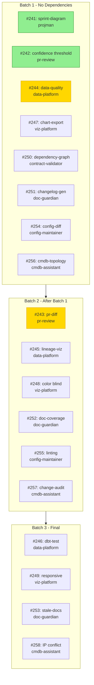
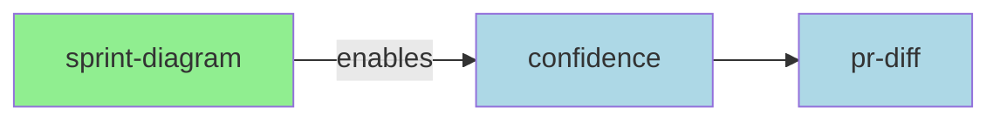

# Sprint Diagram

This command generates a visual Mermaid diagram showing the current sprint's issues, their dependencies, and execution flow.

## What This Command Does

1. **Fetch Sprint Issues** - Gets all issues for the current sprint milestone
2. **Fetch Dependencies** - Retrieves dependency relationships between issues
3. **Generate Mermaid Syntax** - Creates flowchart showing issue flow
4. **Apply Status Styling** - Colors nodes based on issue state (open/closed/in-progress)
5. **Show Execution Order** - Visualizes parallel batches and critical path

## Usage

```
/sprint-diagram
/sprint-diagram --milestone "Sprint 4"
```

## MCP Tools Used

**Issue Tools:**
- `list_issues(state="all")` - Fetch all sprint issues
- `list_milestones()` - Find current sprint milestone

**Dependency Tools:**
- `list_issue_dependencies(issue_number)` - Get dependencies for each issue
- `get_execution_order(issue_numbers)` - Get parallel execution batches

## Implementation Steps

1. **Get Current Milestone:**
   ```
   milestones = list_milestones(state="open")
   current_sprint = milestones[0]  # Most recent open milestone
   ```

2. **Fetch Sprint Issues:**
   ```
   issues = list_issues(state="all", milestone=current_sprint.title)
   ```

3. **Fetch Dependencies for Each Issue:**
   ```python
   dependencies = {}
   for issue in issues:
       deps = list_issue_dependencies(issue.number)
       dependencies[issue.number] = deps
   ```

4. **Generate Mermaid Diagram:**
   ```mermaid
   flowchart TD
       subgraph Sprint["Sprint 4 - Commands"]
           241["#241: sprint-diagram"]
           242["#242: confidence threshold"]
           243["#243: pr-diff"]

           241 --> 242
           242 --> 243
       end

       classDef completed fill:#90EE90,stroke:#228B22
       classDef inProgress fill:#FFD700,stroke:#DAA520
       classDef open fill:#ADD8E6,stroke:#4682B4
       classDef blocked fill:#FFB6C1,stroke:#DC143C

       class 241 completed
       class 242 inProgress
       class 243 open
   ```

## Expected Output

```
Sprint Diagram: Sprint 4 - Commands
===================================



## Status Legend

| Status | Color | Description |
|--------|-------|-------------|
| Completed | Green | Issue closed |
| In Progress | Yellow | Currently being worked on |
| Open | Blue | Ready to start |
| Blocked | Red | Waiting on dependencies |

## Diagram Types

### Default: Dependency Flow
Shows how issues depend on each other with arrows indicating blockers.

### Batch View (--batch)
Groups issues by execution batch for parallel work visualization.

### Plugin View (--by-plugin)
Groups issues by plugin for component-level overview.

## When to Use

- **Sprint Planning**: Visualize scope and dependencies
- **Daily Standups**: Show progress at a glance
- **Documentation**: Include in wiki pages
- **Stakeholder Updates**: Visual progress reports

## Integration

The generated Mermaid diagram can be:
- Pasted into GitHub/Gitea issues
- Rendered in wiki pages
- Included in PRs for context
- Used in sprint retrospectives

## Example

```
User: /sprint-diagram

Generating sprint diagram...

Milestone: Sprint 4 - Commands (18 issues)
Fetching dependencies...
Building diagram...



Open: 16 | In Progress: 1 | Completed: 1
```

## Visual Output

When executing this command, display the plugin header:

```
╔══════════════════════════════════════════════════════════════════╗
║  📋 PROJMAN                                                      ║
║  Sprint Diagram                                                  ║
╚══════════════════════════════════════════════════════════════════╝
```

Then proceed to generate the diagram.
