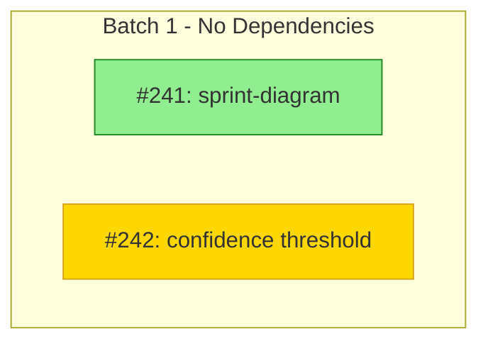

# Sprint Status

## Skills Required

**Always loaded:**
- skills/mcp-tools-reference.md

**Conditional — only load if matching flag is present:**
- skills/sprint-lifecycle.md — load if displaying lifecycle state (always, but this is small)
- skills/dependency-management.md — load ONLY with `--diagram` flag
- skills/token-budget-report.md — load ONLY with `--tokens` flag
- skills/progress-tracking.md — load ONLY with `--diagram` flag

## Purpose

Check current sprint progress, identify blockers, and show execution status. Optionally generate a visual dependency diagram or token budget report.

## Invocation

```
/sprint-status              # Text-based status report
/sprint-status --diagram    # Include Mermaid dependency diagram
/sprint-status --tokens     # Show token budget estimation report
```

## Workflow

1. **Fetch Active Milestone** — `get_milestone` for the open milestone
2. **Read Lifecycle State** — Parse `**Sprint State:**` from milestone description
3. **Fetch Sprint Issues** — `list_issues` filtered by milestone
4. **Calculate Progress** — Count closed vs total issues
5. **Identify Blockers** — Find issues with `Status/Blocked` label
6. **Display Output** — Format header + progress bar + issue table + blockers

That's it. No dependency analysis, no token estimation, no progress comment parsing unless a flag asks for it.

### If --diagram flag, THEN ALSO:
7. Fetch dependencies with `list_issue_dependencies`
8. Load `skills/dependency-management.md`
9. Load `skills/progress-tracking.md`
10. Generate Mermaid diagram

### If --tokens flag, THEN ALSO:
11. Load `skills/token-budget-report.md`
12. **Generate Token Budget Report** - Execute `skills/token-budget-report.md` estimation model
    - Phase: STATUS (read-only snapshot, not a workflow boundary)
    - List MCP servers from `.mcp.json` with static overhead estimates
    - Show current session cost estimate based on skills loaded so far
    - Display formatted report per the skill's Display Format section

## Output Format

### Default Output (no flags)

```
╔══════════════════════════════════════════════════════════════════╗
║  📋 PROJMAN                                                      ║
║  📊 STATUS                                                       ║
║  [Sprint Name]                                                   ║
╚══════════════════════════════════════════════════════════════════╝

Sprint State: [Planning|Executing|Blocked|Review|Closing]

Progress: [██████████░░░░░░░░░░] 50% (5/10 issues)

| # | Title | Status | Labels |
|---|-------|--------|--------|
| 123 | Issue title | Open | Priority/High |
| 124 | Another issue | Closed | Type/Bug |

Blockers:
- #125: Blocked issue title (Status/Blocked)
```

### Diagram Format (--diagram)



### Status Colors

| Status | Color | Hex |
|--------|-------|-----|
| Completed | Green | #90EE90 |
| In Progress | Yellow | #FFD700 |
| Open | Blue | #ADD8E6 |
| Blocked | Red | #FFB6C1 |
