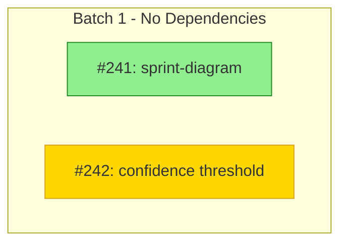

# Sprint Status

## Skills Required

- skills/mcp-tools-reference.md
- skills/progress-tracking.md
- skills/dependency-management.md

## Purpose

Check current sprint progress, identify blockers, and show execution status. Optionally generate a visual dependency diagram.

## Invocation

```
/sprint-status              # Text-based status report
/sprint-status --diagram    # Include Mermaid dependency diagram
```

## Workflow

1. **Fetch Sprint Issues** - Get all issues for current milestone
2. **Calculate Progress** - Count completed vs total issues
3. **Identify Active Tasks** - Find issues with `Status/In-Progress`
4. **Identify Blockers** - Find issues with `Status/Blocked`
5. **Show Dependency Status** - Which tasks are now unblocked
6. **Parse Progress Comments** - Extract real-time status from structured comments

### If --diagram flag:

7. **Fetch Dependencies** - Use `list_issue_dependencies` for each issue
8. **Get Execution Order** - Use `get_execution_order` for batch grouping
9. **Generate Mermaid Syntax** - Create flowchart with status colors

## Output Format

See `skills/progress-tracking.md` for the progress display format.

### Diagram Format (--diagram)



### Status Colors

| Status | Color | Hex |
|--------|-------|-----|
| Completed | Green | #90EE90 |
| In Progress | Yellow | #FFD700 |
| Open | Blue | #ADD8E6 |
| Blocked | Red | #FFB6C1 |

## Visual Output

```
╔══════════════════════════════════════════════════════════════════╗
║  📋 PROJMAN                                                      ║
║  📊 STATUS                                                       ║
║  [Sprint Name]                                                   ║
╚══════════════════════════════════════════════════════════════════╝
```
